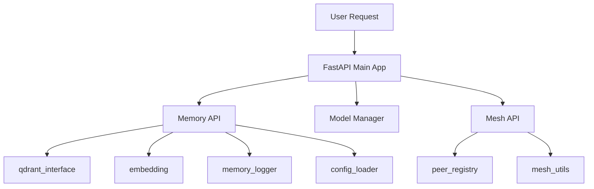

 # PanAI Seed Node Architecture
 
 ## Overview
 
 PanAI is designed as a decentralized, ethically grounded AI framework for memory, reflection, and coordination across distributed systems. Its architecture prioritizes local-first processing, modular design, and extensible node-to-node communication.
 
 ---
 
 ## Core Components
 
### 🧠 Memory API
A FastAPI-based microservice responsible for:
- Logging user/system-generated memory entries
- Performing reflection, summarization, and advice generation
- Embedding and storing vectors in a local Qdrant instance
- Modularized into `qdrant_interface`, `embedding`, `config_loader`, and `memory_logger` for separation of concerns
 
### 🔄 Chat and Inference Services
- Dynamic model selection based on task type
- Inference endpoints leverage multiple models across nodes (e.g., Qwen3 on Apple Silicon, Mistral on GPU systems)
- Uses Ollama or direct llama.cpp-based execution for local inference
- Supports dynamic model discovery and registration via `model_manager.py`
- Expanding support for heterogeneous model federation
---

### 🧩 Modular Design

PanAI has been actively refactored to support a clean, modular architecture:
- Each major domain (memory, mesh, models) has its own directory and logic boundaries
- Shared services like logging, config loading, and embedding are isolated into maintainable modules
- This separation simplifies scaling, onboarding contributors, and writing reliable tests

#### Component Relationships


 
 ### 🔗 Node Mesh
 - Each PanAI instance can query others on the LAN via REST API
 - Supports future peer validation and routing strategies
 - Node registry (`nodes.json`) stores peer metadata and health info
 - Nodes now advertise available models during sync
 
 ---
 
 ## Trust and Audit Layer (Planned)
 
 ### 🧾 Merkle Anchored Audit Logs
 
 To ensure memory immutability and provenance:
 - Logs are hashed periodically into a Merkle tree
 - The root hash is written to a blockchain (or mock chain in early phases)
 - Each node retains a local mapping of memory → Merkle proof → TX hash
 
 This architecture supports lightweight, verifiable audit trails without requiring full on-chain storage.
 
 ### 🧱 Trust Architecture Flow
 
 ```mermaid
 flowchart LR
   subgraph PanAI_Node
     A[FastAPI Chat or Memory API] --> B[Markdown Log or Vector Store]
     B --> C{Merkle Tree Builder}
     C --> D[Root Store + Metadata]
   end
 
   subgraph Anchor_Service
     D --> E[Blockchain Client or Anchor API]
     E --> F[Commit: Root + Timestamp]
   end
 
   subgraph Blockchain_Network
     F --> G[Validator Nodes]
     G --> H[Immutable Ledger]
   end
 ```
 
 ---
 
 ## Planned Enhancements
 
 - Secure cross-node memory sharing via signed payloads
 - Optional ZK-proofs or pseudonymous keys for log commitments
 - Dedicated Anchor Microservice for real-time Merkle tracking
 - CLI tools to recompute and verify historic checkpoints
 - Dynamic model capability federation
 
 ---
 
 ## Philosophy
 
 PanAI isn’t just about distributed AI—it’s about trusted cognition. By pairing reflection with transparency, and privacy with verifiability, it sets a path for ethical, persistent, and adaptive AI systems.